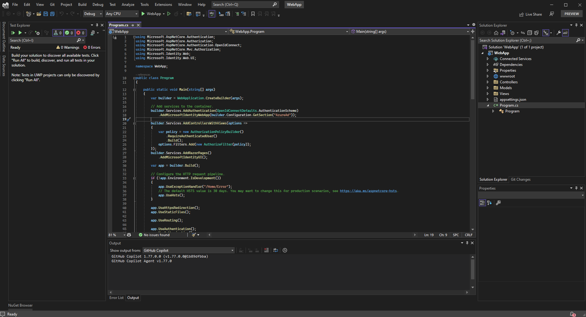
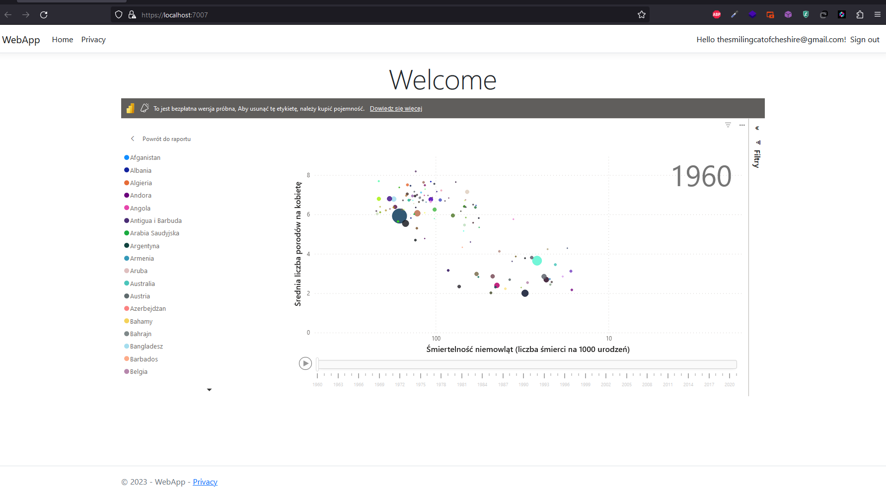

# Witryna World Facts

Aplikację webową w ASP.NET Core MVC. Aplikacja będzie wykorzystywać bazę danych Azure SQL. W tym celu wykorzystuję Visual Studio 2022. Dodatkowo skorzystam z pakietu Microsoft.PowerBI.Api w celu wyświetlania raportów opublikowanych w aplikacji PowerBI.

Zacząłem od wydania następującego polecenia:

```
dotnet new mvc --auth SingleOrg -o src --use-program-main  --framework net6.0 --name WebApp
```

Polecenie to tworzy projekt aplikacji webowej w architekturze MVC - Model-View-Controller - z wykorzystaniem autoryzacji SingleOrg. Wykorzystuję framework .NET 6.0. Dodatkowo wykorzystuję opcję --use-program-main, która pozwala na wykorzystanie własnej metody Main() w klasie Program.cs.

Dodatkowo, dodałem do projektu dwie biblioteki:

```
dotnet add package Microsoft.PowerBI.Api
dotnet add package Newtonsoft.Json
```

Biblioteka Newtonsoft.Json jest standardową biblioteką do operowania na obiektach JSON. W tym wypadku potrzebuję jej do zarządzania komunikacją z API PowerBI. Drugą pobraną biblioteką jest Microsoft.PowerBI.Api, upraszczająca komunikację z API serwisu PowerBI.

Otworzyłem projekt w Visual Studio 2022.



Do komunikacji z API PowerBI utworzyłem serwis - PowerBiService - odpowiedzialny za udostępnianie danych konfiguracyjnych tokena dostępu. Serwis, wraz ze strukturami danych `PowerBIEmbedConfig` oraz `PowerBISettings` umieściłem w folderze głównym projektu.

```cs
using Microsoft.PowerBI.Api;
using Microsoft.PowerBI.Api.Models;
using Microsoft.Rest;
using Newtonsoft.Json.Linq;

namespace WebApp;

public class PowerBiService
{
    private readonly PowerBISettings _settings;

    public PowerBiService(PowerBISettings settings)
    {
        _settings = settings;
    }

    public async Task<PowerBIEmbedConfig> GetEmbedConfig()
    {
        var accessToken = await GetAccessToken(_settings);
        var tokenCredentials = new TokenCredentials(accessToken, "Bearer");

        using var client = new PowerBIClient(new Uri(_settings.ApiUrl), tokenCredentials);

        var workspaceId = _settings.WorkspaceId;
        var reportId = _settings.ReportId;
        var report = await client.Reports.GetReportInGroupAsync(workspaceId, reportId);
        var generateTokenRequestParameters = new GenerateTokenRequest("view");
        var tokenResponse = await client.Reports.GenerateTokenAsync(workspaceId, reportId, generateTokenRequestParameters);

        var result = new PowerBIEmbedConfig
        {
            Username = _settings.UserName,
            EmbedToken = tokenResponse,
            EmbedUrl = report.EmbedUrl,
            Id = report.Id
        };

        return result;
    }

    private async Task<string?> GetAccessToken(PowerBISettings powerBISettings)
    {
        using var client = new HttpClient();

        var form = new Dictionary<string, string>
        {
            ["grant_type"] = "password",
            ["resource"] = powerBISettings.ResourceUrl,
            ["username"] = powerBISettings.UserName,
            ["password"] = powerBISettings.Password,
            ["client_id"] = powerBISettings.ApplicationId.ToString(),
            ["client_secret"] = powerBISettings.ApplicationSecret,
            ["scope"] = "openid"
        };

        client.DefaultRequestHeaders.TryAddWithoutValidation("Content-Type", "application/x-www-form-urlencoded");

        using var formContent = new FormUrlEncodedContent(form);

        using var response = await client.PostAsync(powerBISettings.AuthorityUrl, formContent);

        var body = await response.Content.ReadAsStringAsync();
        var jsonBody = JObject.Parse(body);

        var errorToken = jsonBody.SelectToken("error");

        if (errorToken != null)
        {
            throw new Exception(errorToken.Value<string>());
        }

        return jsonBody.SelectToken("access_token")?.Value<string>();
    }
}
```

```cs
using Microsoft.PowerBI.Api.Models;

namespace WebApp;

public class PowerBIEmbedConfig
{
    public Guid Id { get; set; }
    public string EmbedUrl { get; set; }
    public EmbedToken EmbedToken { get; set; }

    public int MinutesToExpiration
    {
        get
        {
            var minutesToExpiration = EmbedToken.Expiration - DateTime.UtcNow;
            return minutesToExpiration.Minutes;
        }
    }

    public bool? IsEffectiveIdentityRolesRequired { get; set; }
    public bool? IsEffectiveIdentityRequired { get; set; }
    public bool EnableRLS { get; set; }
    public string Username { get; set; }
    public string Roles { get; set; }
    public string ErrorMessage { get; internal set; }
}
```

```cs
namespace WebApp;

public class PowerBISettings
{
    public Guid ApplicationId { get; set; }
    public string ApplicationSecret { get; set; }
    public Guid ReportId { get; set; }
    public Guid WorkspaceId { get; set; }
    public string AuthorityUrl { get; set; }
    public string ResourceUrl { get; set; }
    public string ApiUrl { get; set; }
    public string EmbedUrlBase { get; set; }
    public string UserName { get; set; }
    public string Password { get; set; }
}
```


Tak przygotowany serwis zostanie wstrzyknięty do kontrolera `HomeController` poprzez mechanizm `Dependency Injection`, domyślnie udostępniany we frameworku ASP.NET.

W tym celu zmodyfikowałem plik `Program.cs`. W metodzie `Main` projektu, tuż przed wywołaniem metody `Build` klasy budowniczego `WebApplicationBuilder`, dodałem serwis `PowerBiService` do kontenera Dependency Injection, w postaci singletonu.

```cs


public static void Main(string[] args)
{
    var builder = WebApplication.CreateBuilder(args);

    // ... reszta programu

    // to dodać
    var powerBISettings = builder
            .Configuration
            .GetSection("PowerBI")
            .Get<PowerBISettings>()
        ;

    var powerBiService = new PowerBiService(powerBISettings);
    builder.Services.AddSingleton(powerBiService);

    // ... późniejszy kod źródłowy
    var app = builder.Build();

    // dalsza część programu
}
```

Ten fragment odpowiada za pobranie z konfiguracji aplikacji sekcji `PowerBI` i utworzenie obiektu `PowerBiSettings`. Obiekt ten zostanie przekazany do konstruktora serwisu `PowerBiService`. Następnie serwis zostanie dodany do kontenera Dependency Injection.

Aby zapewnić użycie serwisu w kontrolerze `HomeController`, dodałem do konstruktora kontrolera parametr typu `PowerBiService`.

```cs

    [Authorize]
    public class HomeController : Controller
    {
        private readonly ILogger<HomeController> _logger;
        private readonly PowerBiService _powerBiService;
        public HomeController(ILogger<HomeController> logger, PowerBiService service)
        {
            _logger = logger;
            _powerBiService = service;
        }

        public async Task<IActionResult> Index()
        {
            var config = await _powerBiService.GetEmbedConfig();
            return View(config);
        }

    // ... reszta programu
    }
```

Kontroler `HomeController` korzysta z serwisu `PowerBiService` w celu pobrania konfiguracji raportu z aplikacji PowerBI. Konfiguracja jest przekazywana do widoku `Index.cshtml`. Wymaga to stworzenie na nowo widoku `Index.cshtml` w folderze `Views/Home`:

```html
@model PowerBIEmbedConfig

@{
    ViewData["Title"] = "Home Page";
}

<style>
    #reportContainer {
        height: 600px;
        width: 100%;
        max-width: 2000px;
    }
</style>

<div class="text-center">
    <h1 class="display-4">Welcome</h1>
    <div id="reportContainer"></div>
</div>

<script src="https://npmcdn.com/es6-promise@3.2.1"></script>
<script src="https://cdnjs.cloudflare.com/ajax/libs/powerbi-client/2.22.2/powerbi.min.js" integrity="sha512-6/5T3RvphqYN/YsdvaxOWktOe2E/9aZGTtV5Azs65TfWUzgPNJS75LBFEo1uKtMirNfauflyAQDTDxaFW4yu/A==" crossorigin="anonymous" referrerpolicy="no-referrer"></script>


@section scripts {
    <script>
        // Read embed application token from Model
        var accessToken = "@Model.EmbedToken.Token";

        // Read embed URL from Model
        var embedUrl = "@Html.Raw(Model.EmbedUrl)";

        // Read report Id from Model
        var embedReportId = "@Model.Id";

        // Get models. models contains enums that can be used.
        var models = window['powerbi-client'].models;

        var config = {
            type: 'report',
            tokenType: models.TokenType.Embed,
            accessToken: accessToken,
            embedUrl: embedUrl,
            id: embedReportId,
            permissions: models.Permissions.All,
            settings: {
                filterPaneEnabled: true,
                navContentPaneEnabled: true
            }
        };

        $(document).ready(function () {
            // Get a reference to the embedded report HTML element
            var reportContainer = $('#reportContainer')[0];

            // Embed the report and display it within the div container.
            powerbi.embed(reportContainer, config);
        });
    </script>
}
```

Użyłem tu dodatkowo zewnętrznego skryptu `powerbi.min.js` do obsługi raportu PowerBI. Użyty kod źródłowy został pobrany ze strony `https://gunnarpeipman.com/aspnet-core-power-bi-embedded/`.

Po uzupełnieniu danych z użyciem "Manage User Secrets" i uruchomieniu aplikacji, powinien pojawić się raport PowerBI na stronie głównej.

```json
{
  "Logging": {
    "LogLevel": {
      "Default": "Information",
      "Microsoft": "Warning",
      "Microsoft.Hosting.Lifetime": "Information"
    }
  },
  "AllowedHosts": "*",
  "AzureAd": {
    "Instance": "https://login.microsoftonline.com/",
    "Domain": "qualified.domain.name",
    "TenantId": "xxxxxxxx-xxxx-xxxx-xxxx-xxxxxxxxxxxx",
    "ClientId": "xxxxxxxx-xxxx-xxxx-xxxx-xxxxxxxxxxxx",
    "CallbackPath": "/signin-oidc"
  },
  "PowerBI": {
    "ApplicationId": "xxxxxxxx-xxxx-xxxx-xxxx-xxxxxxxxxxxx",
    "ApplicationSecret": "xxxxxxxxxxxxxxxxxxxxxxxxxxxxxxxxxxxxxxxx",
    "ReportId": "xxxxxxxx-xxxx-xxxx-xxxx-xxxxxxxxxxxx",
    "WorkspaceId": "xxxxxxxx-xxxx-xxxx-xxxx-xxxxxxxxxxxx",
    "AuthorityUrl": "https://login.microsoftonline.com/xxxxxxxx-xxxx-xxxx-xxxx-xxxxxxxxxxxx/oauth2/token",
    "ResourceUrl": "https://analysis.windows.net/powerbi/api",
    "ApiUrl": "https://api.powerbi.com/",
    "EmbedUrlBase": "https://app.powerbi.com/",
    "UserName": "xxxxxxxxxxxx@domainname.onmicrosoft.com",
    "Password": "xxxxxxxxxxxxxx"
  }
}
```

