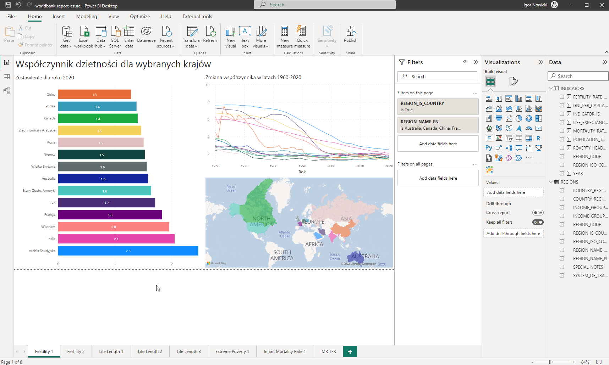
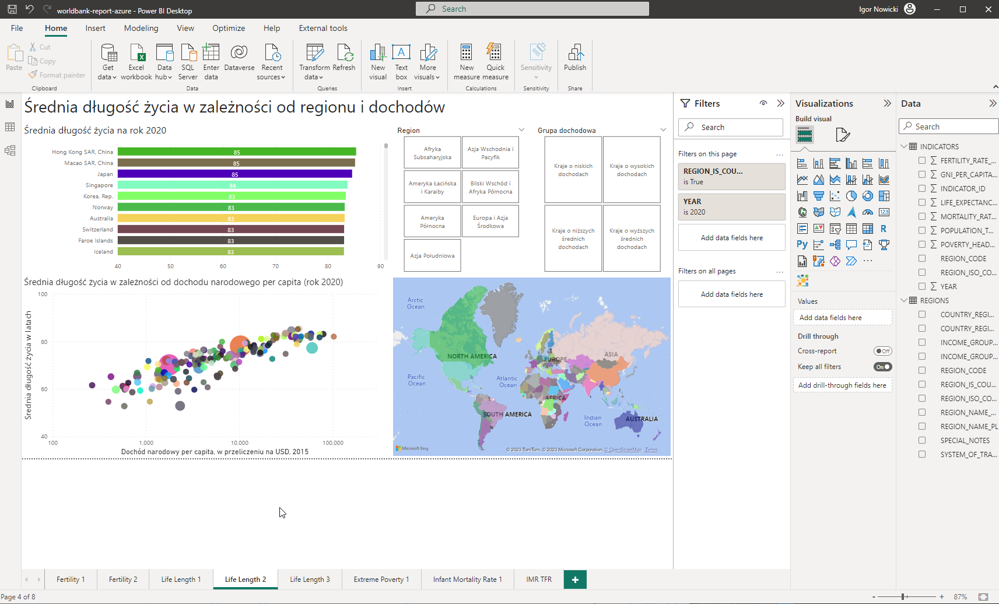

Wykonałem zadanie 'Tasks -> Deploy Database to Azure SQL Database' aby przekształcić bazę danych z wersji Sql Server do wersji Azure SQL.

W raporcie PowerBI wybrałem opcję 'Get Data -> Azure -> Azure SQL Database' i podałem dane do połączenia z bazą danych. Użyłem parametrów 'sql-server' oraz 'sql-database' by mieć możliwość zmiany adresu serwera oraz nazwy bazy danych przy automatycznym wdrażaniu na serwer PowerBI. Ze względu na statyczną naturę raportu zdecydowałem również o użyciu Data Connectivity w wersji Import.

Po ustawieniu parametrów połączenia ze zdalną bazą danych, utworzyłem przykładowy raport z wykorzystaniem współczynników śmiertelności niemowląt i dzietności dla krajów świata na przełomie lat 1960-2020. W celu ułatwienia analizy danych dodałem filtry dla regionów geograficznych oraz grup dochodowych krajów. Do wizualizacji użyłem Scatter Chart z opcją animacji - dla osi Play Axis ustawiłem Year, a dla Size Axis - Population, Total. Dodatkowo, ustawiłem wartości śmiertelności niemowląt jako skalę logarytmiczną i odwróciłem oś, by podróż obydwała się z lewej strony na prawą.

Opublikowałem raport na serwerze PowerBI w celu sprawdzenia zgodności aplikacją i zdalnego połaczenia z bazą danych.

Korzystając ze Stacked Bar Chart, Line Chart oraz Filled Map Chart, utworzyłem wykresy dla współczynnika dzietności dla przykładowych krajów. Utworzyłem zestawienie dla roku 2020 dla wybranych krajów poprzez utworzenie filtra dla krajów (REGION_NAME_EN dla całej strony) oraz lokalnego filtra dla roku.

Utworzyłem kolejne zestawienie dla współczynnika dzietności, tym razem dla wszystkich krajów, dla roku 2020. Tym razem skorzystałem ze Stacked Bar Chart oraz Scatter Chart. Dodałem również filtry dla regionów geograficznych oraz grup dochodowych krajów.

Analogicznie do strony ze współczynnikiem dzietności, utworzyłem stronę raportu z oczekiwaną długością życia przy narodzeniu dla wybranych krajów. Ponownie użyłem Bar Chart dla roku 2020 oraz wykresu Line Chart dla lat 1960-2020. Dodałem również filtry dla regionów geograficznych oraz grup dochodowych krajów.

Utworzyłem stronę ze wskaźnikiem średniej długości życia w zależności od regionu i dochodów dla wszystkich krajów. Użyłem Stacked Bar Chart oraz Line Chart. Dodałem filtry dla regionów geograficznych oraz grup dochodowych krajów.

Postanowiłem utworzyć stronę z zestawieniem oczekiwanej średniej długości życia dla lat 1960 oraz 2020, jak również z wyszczególnieniem jedynie świata. W tym celu utworzyłem dodatkowe tabele filtrujące jedynie po danym roku oraz po danym regionie (w tym wypadku świecie). Nazwałem je, odpowiednio, INDICATORS 1960, INDICATORS 2020 oraz INDICATORS WORLD.

W celu utworzenia zestawienia współczynnika skrajnego ubóstwa na przełomie ostatnich 30 lat, potrzebowałem utworzyć kompilację wyników dla lat 1980-1990. W tym celu utworzyłem duplikat tabeli INDICATORS, następnie dodałem filtry dla lat 1980-1990 i usunąłem wszelkie puste wartości dla kolumny ze wskaźnikiem ubóstwa. Następnie, dokonałem operacji grupowania po kodzie kraju, z utworzeniem kolumny POVERTY, będącej uśrednieniem wartości współczynnika ubóstwa dla lat 1980-1990. 

Utworzyłem analogiczne porównanie dla współczynnika umieralności niemowląt. Ponieważ wartości wskaźnika były zbierane dopiero od lat 1980, utworzyłem kolejną tabelę INDICATORS 1980, w której tabela INDICATORS była filtrowana według roku 1980.

Tak dokonane zestawienia mają na celu przedstawić w sposób przejrzysty i interaktywny trendy dokonujące się na świecie w ciągu ostatnich 70 lat. Wykresy mają być uzupełnieniem do przeprowadzanej ankiety na stronie internetowej, jako bezpośredni dowód na zmiany w świecie.